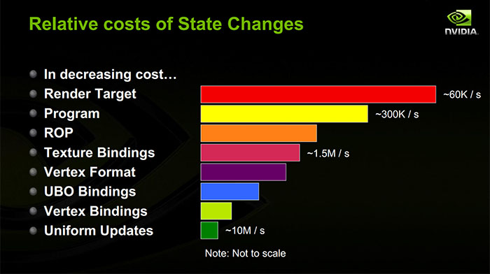
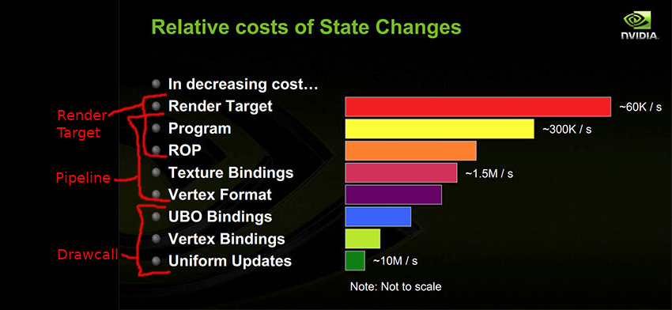

# ggraphics

A small, swift 2D graphics rendering library written in Rust.

Currently, this is essentially an implmentation detail of
[`ggez`](https://ggez.rs/).  It's not really *designed* to be
used as a general-purpose renderer, the crate separation between
ggez and ggraphics is mostly a matter of API convenience.
But other people making 2D games or game engines in Rust
may be interested in it, so, here it is.

# Design

Currently it is a simple 2D-only(ish) quad renderer using OpenGL.
It uses [`glow`](https://crates.io/crates/glow) as a thin OpenGL
portability layer, and takes a somewhat Vulkan/WebGPU-y approach of
render passes containing pipelines containing draw commands.

## Goals

 * Work on desktop, and web via WASM with minimal extra effort
 * Work on OpenGL 4 and comparable API's -- OpenGL ES 3, WebGL 2.
 * Draws textured quads and maybe arbitrary meshes.
 * Support user-defined shaders and render passes.

## Anti-goals

 * Absolutely cross-platform with no effort involved.  Weird platforms
   are always going to require extra work to build for and integrate.
   This should make that process easy, but doesn't need to try to make
   it invisible.
 * General-purpose.  Avoid success at all costs.  Most people should not
   need to use this directly.
 * Support every hardware ever.  Sorry.
 * Include windowing, input, etc.  Those are the jobs of other tools.
 * Sophisticated 3D rendering.  It'd be nice if this were extensible
   enough that you could add your own such things, but currently,
   "textured geometry with shaders" is minimum viable product.
 * Absolute top-shelf performance.  It should not be gratuitously slow,
   and should draw fast enough to be considered Pretty Good, but it
   doesn't need to be gratuitously fast.

## Maybe someday goals

 * Mobile devices as a first-class target
 * Use `gfx-hal`, `rendy`, `wgpu` or some other next-gen graphics
   portability layer.  Currently, the portability is not there.  :-(
 * Work on OpenGL 2 and comparable API's -- OpenGL ES 2, WebGL 1.

## Structure

It is set up more or less as hierarchy of "draw calls", which are
run by "pipelines", which are contained in "render passes".  This is
influenced by the structure of Vulkan, which is based pretty much off
this hierarchy of costs:

We map these costs more or less onto the structure described above:

# License

MIT

# Notes on portability

`glow` does its best to make the differences between OpenGL variants
invisible, but this is basically impossible, so these are the things we
need to be aware of.

## Shaders

WebGL 2 uses GLSL ES 3.00, with some small restrictions.  WebGL 1 uses
GLSL 1.00 ES, with some larger restrictions.  Sources:
<https://www.khronos.org/registry/webgl/specs/latest/2.0/#4.3> and
<https://www.khronos.org/registry/webgl/specs/latest/1.0/#4.3>.
Per these specs, these restrictions are *strict*, so WebGL 2 **should not**
accept GLSL ES 3.10.  (Of course I bet it sometimes does anyway, but
fuck that.) So, to make a shader that works anywhere, write your shader to
target WebGL first, and then it should work on other targets.

GLSL ES 3.00 is based on OpenGL GLSL 3.30, see
<https://www.khronos.org/registry/OpenGL/specs/es/3.0/GLSL_ES_Specification_3.00.pdf>
part 1.1.  It removes a fair pile of stuff though, and adds a pile of
other stuff ranging from as simple as "line continuation" to as ominously
broad as "GLSL ES 1.00 compatibility".

Wikipedia claims that OpenGL 4.3 covers all features of OpenGL ES 3.0
and hence WebGL 2.0.  Looking at the GLSL specs, 3.30 is a strict subset
of 4.00, 4.00 is a strict subset of 4.10.  4.10 to 4.20 and 4.20 to 4.30
say "no features were deprecated" but there are some minor breaking
changes (making variable scoping saner, making #ifdef behaviors more
C++-y and thus insaner) -- however, GLSL 4.3 *explicitly* allows you to
specify `#version 300 es` and get GLSL ES 3.00 shaders out of it.

GREAT!  If you write OpenGL ES 3.0 shaders, and they work on WebGL 2,
then you *should* be able to use them anywhere.
